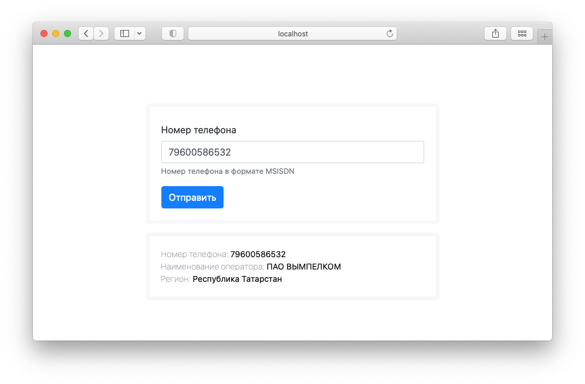

## Определяем информацию(регион, оператор) по номеру телефона

Веб-приложение позволяет получить информацию по оператору на основании номера.   
Приложение позволяет обновить базу номеров, отразить статус обновления и откатить обновление на предыдущие даты обновления. 

### Реестр российской системы и плана нумерации
https://opendata.digital.gov.ru/registry/numeric/downloads/


### Стек  
Django  
Vue.js  
Postgres  
Docker

### Описание настроек
В файле проекта `/num_data/management/commands/update_phone_base.py` в опции `PHONEBASE_ROSSVYAZ`
установлены адреса источника данных в виде ссылки на загружаемый документ, формате csv для последуюшего импорта в postgres

### Периодическое обновление данных
Обновление реализовано через вызов management команды django в каталоге проекта: ` python manage.py update_phone_base`  
Проект поддерживает возможность отката к предыдущей дате обновления, данная опция доступна в административном интерфейсе Django

### Скрипт API расположен по адресу
`http://localhost:8000/api/v1/info`

Пример ответа:
```json
{
    "number": [
        {
            "number": "89600586532",
            "cod": 960,
            "from_range": 300000,
            "to_range": 899999,
            "capacity_range": 600000,
            "operator": "ПАО \"ВЫМПЕЛКОМ\"",
            "region": "Республика Татарстан"
        }
    ]
}
```
### Запуск проекта в среде Docker
В дирректории с проектом выполнить команду `docker-compose up`  
Команда запуска получения данных из Реестр российской системы и плана нумерации  `docker-compose exec WEB python3 manage.py update_phone_base`

#### Создать и заполнить своими данными файл переменных окружения:   
Пример local.env (на одном уровне с docker-compose.yml) 
```
PGADMIN_DEFAULT_EMAIL=admin@admin.ru
PGADMIN_DEFAULT_PASSWORD=admin
DJANGO_SETTINGS_MODULE=find_number.settings
DJANGO_WSGI=find_number.wsgi
PYTHONUNBUFFERED=1
DATABASE_URL=postgres://localdb:localdb@db:5432/localdb
POSTGRES_USER=localdb
POSTGRES_PASSWORD=localdb
POSTGRES_DB=localdb
POSTGRES_HOST=db
C_FORCE_ROOT=true
SECRET_KEY==@ncgb%60i%044*9yu%*$^$55s+(-y#qj_+4ldra-syv!62yu@
DEBUG=True
DJANGO_ADMINISTRATOR_PASS=adminpass
```
#### Учетные данные для доступа в административный интерфейс Django: `/admin`
administrator  
adminpass  

